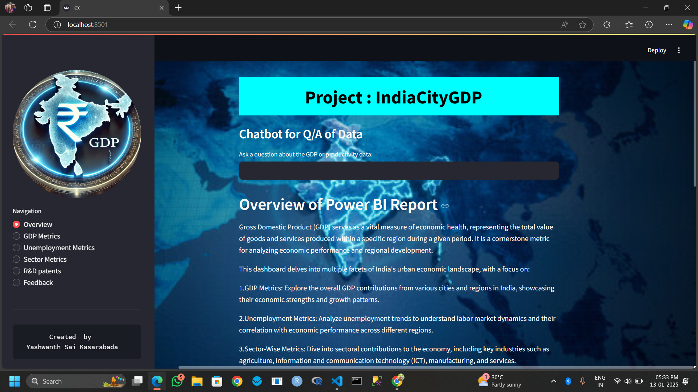

# IndiaCityGDP: A Visualization of Urban Economic Metrics 🌆📊

**IndiaCityGDP** is a data visualization project that analyzes GDP and economic productivity across Indian cities. It leverages **Python (Pandas, NumPy)** for data processing and **Power BI & Streamlit** for interactive visualization. The project aims to provide policymakers, business leaders, and researchers with insights into urban economic performance using real-world data from government reports and economic surveys.

## 🚀 Features
- **Economic Data Analysis**: Analyzes GDP, productivity, and growth trends across major Indian cities.
- **Interactive Dashboards**: Power BI & Streamlit-based visualizations for better insights.
- **Data Handling**: Utilizes **Pandas, NumPy** for efficient data processing.
- **User-Friendly Interface**: Streamlit web app for easy access to economic metrics.
- **Reliable Data Sources**: Data is collected from **government reports, economic surveys, and open data portals**.

## 🏗️ Tech Stack
- **Programming Language**: Python 🐍
- **Libraries**: Pandas, NumPy, Matplotlib, Plotly, Streamlit
- **Visualization Tools**: Power BI, Streamlit
- **Data Sources**: Government reports, economic surveys

## 📊 Power BI & Streamlit Visualizations
- **GDP Growth Comparison Across Cities**
- **Sector-wise Economic Contributions**
- **City-wise Productivity Trends**
- **Interactive Filters & Insights**

pip install -r requirements.txt

streamlit run streamlit_app/app.py
4️⃣ Open the Power BI Dashboard
Open powerbi_dashboard/IndiaCityGDP.pbix in Power BI Desktop.
📸 Screenshots

🔮 Future Enhancements
Expand data sources for real-time GDP tracking.
Add predictive models for economic forecasting.
Improve UI/UX with advanced visualizations.
📜 License
This project is open-source under the MIT License.

🤝 Contributing
Feel free to fork the repository, raise issues, and submit pull requests! 🚀

📩 Contact
## 📩 Contact
For queries, reach out via [LinkedIn](https://www.linkedin.com/in/yashwanth-sai-kasarabada-ba4265258/) or email.

